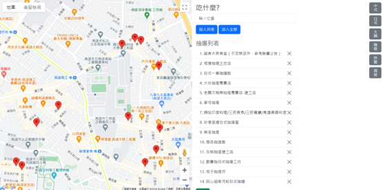
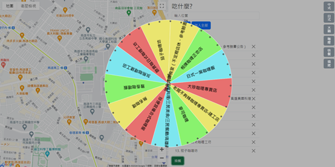

# 🍽️ Mealtime - 餐廳隨機抽選器

> 一個結合 Google Maps API 與轉盤抽籤功能的互動式餐廳選擇工具




## 📖 專案簡介

**Mealtime** 是一個幫助使用者解決「吃什麼」難題的網頁應用程式。透過整合 Google Maps Places API，使用者可以搜尋附近餐廳、依類別篩選，並使用轉盤抽籤功能來決定用餐地點。

這個專案源自於日常生活中常遇到的問題：和朋友出門時總是為了「要吃什麼」討論很久。於是我開發了這個工具，結合地圖搜尋和隨機抽籤，讓決策過程變得更有趣也更有效率。

## ✨ 主要功能

### 🔍 餐廳搜尋
- **即時搜尋**: 利用 Google Places Autocomplete 提供即時搜尋建議
- **類別篩選**: 提供中式、日式、火鍋、咖哩、快餐、燒烤等預設類別
- **附近搜尋**: 基於使用者位置搜尋 1km 範圍內的餐廳

### 🗺️ 地圖功能
- **互動式地圖**: 顯示使用者位置與搜尋結果
- **餐廳資訊**: 點擊標記顯示名稱、地址、電話、評分
- **路線導航**: 顯示從當前位置到餐廳的步行路線與時間

### 🎰 抽籤功能
- **視覺化轉盤**: 使用 Winwheel.js 實作平滑的轉盤動畫
- **隨機抽選**: 基於隨機演算法確保公平性
- **自動導航**: 抽中後自動在地圖上顯示餐廳位置與路線

### 💾 資料管理
- **本地儲存**: 使用 localStorage 持久化儲存餐廳清單
- **清單管理**: 支援新增、刪除、批次匯入功能
- **資料同步**: 轉盤與清單即時同步更新

## 🛠️ 技術架構

### 核心技術
- **HTML5 / CSS3**: 響應式網頁設計
- **JavaScript (ES6+)**: 原生 JavaScript 實作
- **Bootstrap 5.3.3**: UI 框架與元件

### API 與套件
- **Google Maps JavaScript API**: 地圖與地點服務
  - Maps API
  - Places API (2024 版本)
  - Directions API
- **Winwheel.js**: 轉盤抽籤動畫
- **GSAP (GreenSock)**: 動畫引擎

## ⚠️ 重要提醒

### 目前專案狀態

**本專案使用 Google Maps Places API (2024 版本)**

> ⚡ 請注意：由於 Google 在 2024-2025 年間逐步棄用舊版 Places API，**本專案的類別搜尋功能目前無法正常運作**。這是一個真實開發中常見的情況：第三方 API 版本更新導致部分功能受影響。

### ✅ 正常運作的功能
- 搜尋框餐廳搜尋（使用 Autocomplete）
- 地圖顯示與使用者定位
- 轉盤抽籤功能
- 路線導航與步行時間計算
- 餐廳清單管理（新增、刪除、本地儲存）

### ⚠️ 待修復功能
- 右側類別按鈕搜尋（需升級至新版 Places API 的 `searchByText`）

### 技術債說明

這個狀況展示了軟體開發中的真實挑戰：
1. **第三方依賴管理**: API 版本更新影響現有功能
2. **向後相容性問題**: 舊版 `nearbySearch` 已被標記為 deprecated
3. **升級規劃**: 需要重構以適配新版 API 架構

如需升級至最新版 API，需要進行以下調整：
- 將 `google.maps.places.PlacesService.nearbySearch` 遷移至 `google.maps.places.Place.searchByText`
- 將 `google.maps.Marker` 遷移至 `google.maps.marker.AdvancedMarkerElement`
- 將 `google.maps.places.Autocomplete` 遷移至 `google.maps.places.PlaceAutocompleteElement`
- 加入 `mapId` 參數以支援新版 Advanced Markers

詳細遷移指南請參考：[Google Maps Platform Migration Guide](https://developers.google.com/maps/documentation/javascript/places-migration-overview)

## 🚀 快速開始

### 前置需求

1. **Google Maps API Key**
   - 前往 [Google Cloud Console](https://console.cloud.google.com/)
   - 建立專案並啟用以下 API：
     - Maps JavaScript API
     - Places API
     - Directions API
   - 建立 API Key

2. **Web Server**
   - 本地開發可使用 Live Server 或任何 HTTP 伺服器
   - 不支援直接以 `file://` 協定開啟

### 安裝步驟

1. **Clone 專案**
   ```bash
   git clone https://github.com/yourusername/mealtime.git
   cd mealtime
   ```

2. **設定 API Key**
   
   在 `index.html` 中找到以下程式碼並替換為你的 API Key：
   ```html
   <script 
       async
       src="https://maps.googleapis.com/maps/api/js?key=YOUR_API_KEY_HERE&loading=async&libraries=places&callback=initMap&region=TW&language=zh-TW">
   </script>
   ```

3. **啟動專案**
   ```bash
   # 使用 Python
   python -m http.server 8000
   
   # 或使用 Node.js http-server
   npx http-server
   
   # 或使用 VS Code Live Server
   # 右鍵點擊 index.html > Open with Live Server
   ```

4. **開啟瀏覽器**
   ```
   http://localhost:8000
   ```

## 📁 專案結構

```
mealtime/
├── index.html          # 主要 HTML 檔案
├── Winwheel.js        # 轉盤動畫庫
├── README.md          # 專案說明文件
└── images/       # 專案截圖
```

## 💡 使用說明

### 基本流程

1. **允許位置存取**: 首次使用需允許瀏覽器存取您的位置
2. **搜尋餐廳**:
   - 使用搜尋框輸入餐廳名稱
   - 或點擊右側類別按鈕搜尋特定類型餐廳
3. **建立清單**:
   - 點擊「加入列表」新增單一餐廳
   - 點擊「加入全部」將搜尋結果全部加入
4. **開始抽籤**:
   - 點擊「抽籤」按鈕啟動轉盤
   - 轉盤停止後自動顯示餐廳資訊與路線

### 進階功能

- **刪除餐廳**: 點擊餐廳清單右側的 ✕ 按鈕
- **查看路線**: 抽中餐廳後地圖自動顯示步行路線
- **重複使用**: 餐廳清單會自動儲存，下次開啟直接使用

## 🎨 介面設計

- **左側面板**: 互動式 Google 地圖
- **右側面板**: 搜尋介面與餐廳清單
- **側邊按鈕**: 快速類別篩選（直書排版）
- **轉盤動畫**: 全螢幕覆蓋層，提供沉浸式體驗

## 🔒 瀏覽器支援

- ✅ Chrome 90+
- ✅ Firefox 88+
- ✅ Safari 14+
- ✅ Edge 90+

需要支援以下 API：
- Geolocation API
- LocalStorage API
- Canvas API

## 🐛 已知問題

1. **類別搜尋功能失效**: 由於使用舊版 `nearbySearch` API，右側類別按鈕搜尋功能目前無法正常運作（見上方「專案狀態」說明）
2. **API 棄用警告**: Console 會顯示 Google Maps API 棄用警告，這是預期行為
3. **位置權限**: 若使用者拒絕位置存取，預設顯示台灣中心位置
4. **離線使用**: 需要網路連線才能載入地圖與搜尋餐廳

## 🚧 未來計畫

由於 Google Places API 的版本更新，目前優先計畫是升級至新版 API 以恢復類別搜尋功能。

## 📝 開發紀錄

### 版本歷史

- **v1.0.0** (2024)
  - 初版發布
  - 整合 Google Maps Places API
  - 實作轉盤抽籤功能
  - 本地儲存餐廳清單

## 👨‍💻 關於作者

這個專案是我在學習 Web 開發過程中的實作作品，展示了以下技能：

- ✅ Google Maps API 整合與應用
- ✅ 原生 JavaScript DOM 操作
- ✅ LocalStorage 資料持久化
- ✅ 第三方套件整合（Winwheel.js, GSAP）
- ✅ 非同步程式設計（Async/Await）
- ✅ 使用者體驗設計

---

## 參考資料

- [Google API 介紹](https://mile.cloud/zh/resources/blog/What-is-Google-API-one-time-to-know-five-types-of-Google-API_60)) - Google API 是什麼？一次搞懂五種 Google API
- [Winwheel.js](https://dougtesting.net/winwheel/history)) - 轉盤動畫庫
